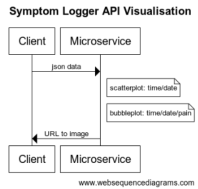
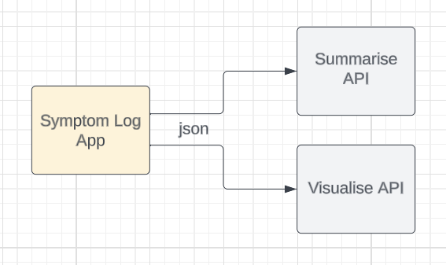

# Vsualize API for Symptom Logger

A microservice to communicate with my client endpoint using json, to receive symptom data and return a url to either an image of a scatterplot or a bubbleplot.

Creating a microservice for visualization allows me to update and improve it (such as using different data visualization) without affecting either the client app or the summarization API.

This API is part of a larger design for an application to allow users to input symptoms in a free-text format. After logging the symptoms, the application uses two separate APIs: one to summarize the entered data and another to create visual representations of that data.

